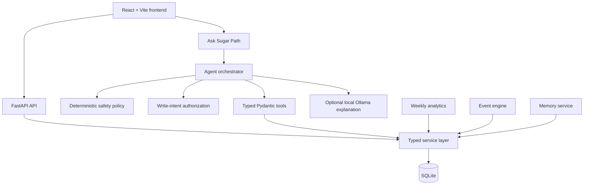

# Sugar Path

Sugar Path is a local-first diabetes companion prototype that combines structured health tracking, a tool-calling AI assistant, transparent persistent memory, deterministic weekly analytics, and in-app events while keeping medical safety logic outside the LLM.

> **Prototype disclaimer:** Sugar Path uses a fictional patient and synthetic health data. It is not medical software, has no clinical validation, and does not diagnose, provide emergency care, or recommend medication or insulin dosing.

## Overview

The responsive React interface shows synthetic glucose history, medicine, meals, activity, sleep, memory, weekly summaries, and local notifications. Health data and critical decisions stay in typed backend services; optional Ollama can explain only data obtained through explicit tools.

## Architecture



Ollama never connects to SQLite, receives SQL, or receives an unrestricted database dump. See [architecture details](docs/ARCHITECTURE.md).

## Product approach

- Seed a fictional demo patient in SQLite.
- Keep analytics, events, safety, and write authorization deterministic.
- Use an optional local model for grounded explanations, not database access or medical decisions.
- Keep memory structured, visible, and deletable.

## Screens and features

- **Dashboard:** current synthetic glucose, medicine, activity, and latest meal.
- **Glucose:** deterministic five-minute mock-CGM history.
- **Medicine and meals:** validated local record updates.
- **Ask Sugar Path:** optional Ollama answers through typed backend tools.
- **Memory:** inspectable routines, preferences, facts, and observations.
- **Weekly report:** seven-day Python-calculated analytics and a deterministic fallback.
- **Notifications:** on-demand, persisted, deduplicated local events.

Recommended portfolio screenshots: Dashboard, Ask Sugar Path, Weekly Report, Memory, and Notifications. No fake screenshots are included.

## Agent, safety, memory, analytics, and events

The agent loop is: patient question → deterministic safety check → Ollama selects a named typed tool → deterministic write-intent authorization → Pydantic validation → application service → structured result → Ollama explanation.

The model cannot access SQL, bypass safety, directly mutate state, or receive raw database exports. Dose-change requests are rejected before a model call. Model-selected writes are rejected unless the patient explicitly requested that record change.

Memory is a small SQLite record, not a transcript. It has constrained categories/sources, rejects obvious medical instructions, can be deleted, and is normalized for deduplication. Weekly metrics are calculated in Python before any optional explanation. Patterns require evidence thresholds and remain observational. Events use persisted keys; repeat evaluation does not duplicate notifications.

## Technology stack

React, TypeScript, Vite, FastAPI, Pydantic, SQLAlchemy, SQLite, pytest, and optional local Ollama.

## Run locally

Copy `.env.example` to `.env` to override defaults.

```powershell
cd backend
python -m venv .venv
.venv\Scripts\activate
pip install -r requirements.txt
uvicorn app.main:app --reload
```

In another terminal:

```powershell
cd frontend
npm install
npm run dev
```

Open `http://127.0.0.1:5173`. FastAPI OpenAPI docs are at `http://127.0.0.1:8000/docs`; the non-sensitive service check is `GET /health`.

### Environment configuration

`.env.example` documents `DEMO_MODE`, `DATABASE_URL`, `APP_NAME`, CORS origins, Ollama URL/model/timeout, tool iterations, medicine timing/grace, and demo glucose thresholds. Settings are validated at startup. Never commit `.env`.

### Optional Ollama

Only Ask Sugar Path requires Ollama. Tracking, memory API/UI, reports, event evaluation, and notifications work without it; chat returns a controlled unavailable message.

```powershell
ollama serve
ollama pull llama3.2:3b
```

Set `OLLAMA_MODEL=llama3.2:3b` in `.env`. Tool-capable local models may be slow depending on hardware; no latency is promised.

### Docker (local development)

`docker compose up --build` starts frontend/backend with a named SQLite volume. It does not run Ollama. To use host Ollama from the backend container, configure a host-reachable `OLLAMA_BASE_URL` (commonly `http://host.docker.internal:11434` on Docker Desktop) and `OLLAMA_MODEL`.

## Tests and release verification

```powershell
cd backend
python -m pytest -q
cd ..\frontend
npm run build
```

Or run `scripts\verify_release.ps1` from the root. Tests cover dashboard, medicine, agent/tool validation, safety, memory, reports, events, notifications, and API validation; Ollama is not required.

## Project structure

```text
backend/app/        API, agents, models, safety, schemas, services, seed
backend/tests/      deterministic regression tests
backend/scripts/    optional real-Ollama smoke script
frontend/src/       React UI, app shell, API client, types
docs/               architecture and demo guide
scripts/            release verification
```

## Engineering highlights

- Local Ollama tool-calling agent with an explicit typed registry.
- Deterministic safety and write authorization outside the LLM.
- Persistent, transparent, patient-controlled structured memory.
- Deterministic analytics and deduplicated event architecture.
- Adversarial safety and persistence regression suite.
- Responsive React patient UI.

## Known limitations and future work

Sugar Path is a single-demo-patient, synthetic-data prototype using local SQLite. It has no production authentication, multi-patient isolation, clinical validation, external CGM/platform integration, external notification delivery, scheduled worker, or production-grade migration workflow. Event evaluation is on demand and Ollama speed depends on the machine.

Future directions (not implemented) include a Dexcom sandbox adapter, Health Connect, clinician-configured thresholds, consented external notifications, authentication/multi-patient isolation, PostgreSQL, worker infrastructure, and stronger model runtimes.

## Demo

Follow the reliable 5–7 minute walkthrough in [docs/DEMO.md](docs/DEMO.md).
